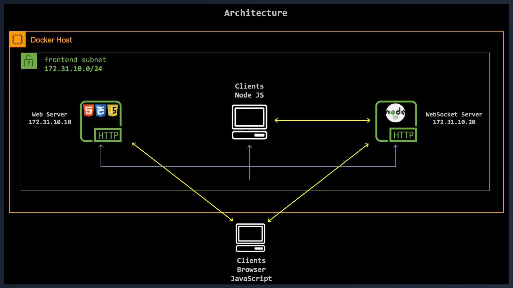
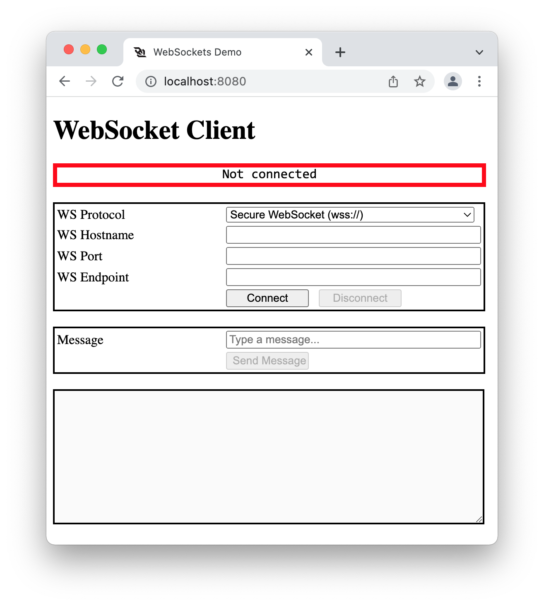
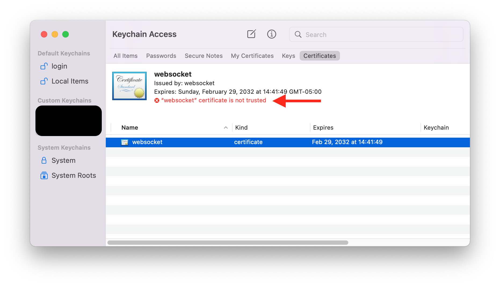
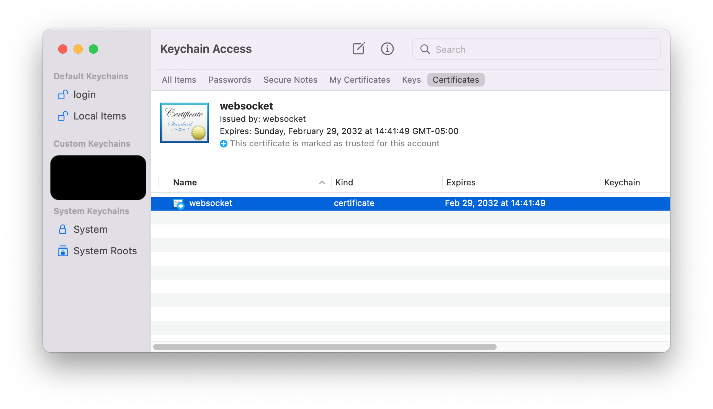
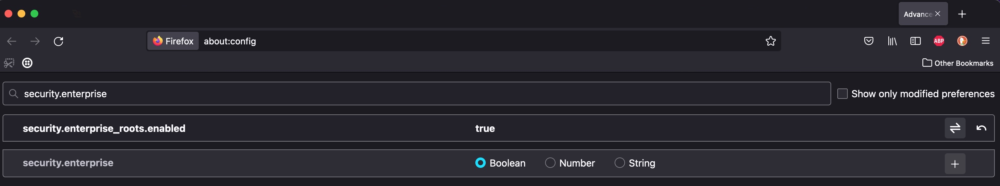
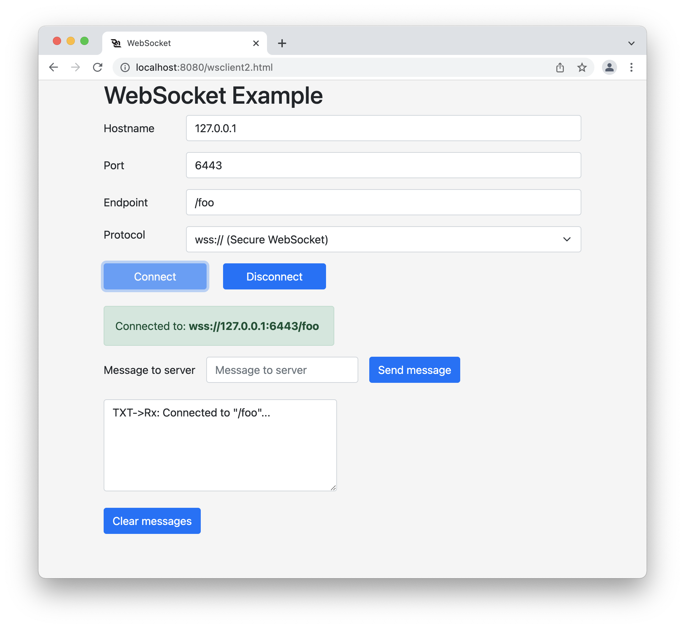
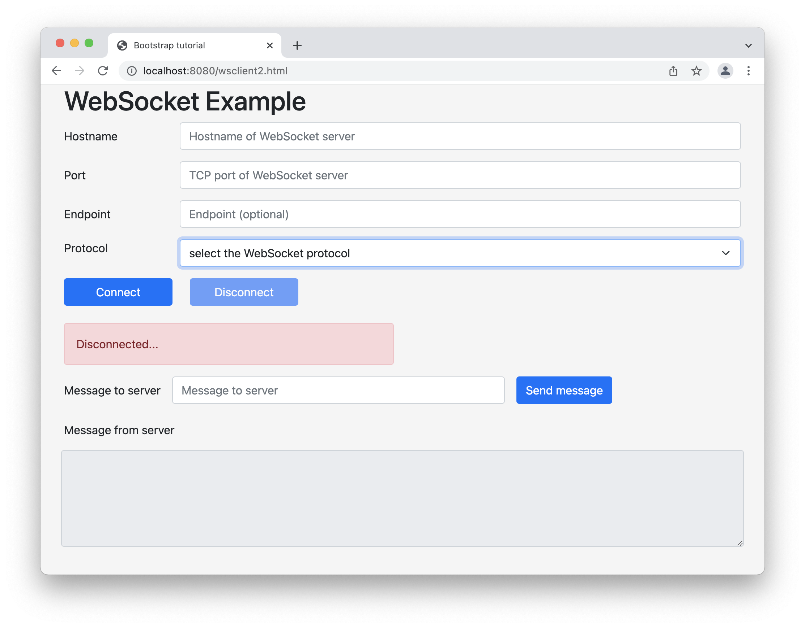


# WebSocket Client Server

### Introduction

This workshop is about building a client and server WebSocket on different Docker containers.

- Web Server on Nginx, that will host the JavaScript (the Client)
- Secure WebSocket Server in Python (the Server)
- Non-Secure WebSocket Server in Python (the Server)

The WebSocket Protocol enables bi-directional, full duplex communications protocol between a client and a server. It provides a persistent connection between them and both parties can sending data at any time. It is commonly used in modern web applications for streaming data and other asynchronous traffic. The goal of this technology is to provide a mechanism for browser-based applications that need two-way communication with servers without the need to open multiple HTTP connections.

<a title="Brivadeneira, CC BY-SA 4.0 &lt;https://creativecommons.org/licenses/by-sa/4.0&gt;, via Wikimedia Commons" href="https://commons.wikimedia.org/wiki/File:Websocket_connection.png"></a>

>The WebSocket specification defines two URI schemes:   
>ws-URI = "ws:" "//" host [ ":" port ] path [ "?" query ]   
>wss-URI = "wss:" "//" host [ ":" port ] path [ "?" query ]   

The client is the browser with a simple JavaScript that will initiate the WebSocket. It could be either `ws://`, which is the equivalent to `http://`, or secure WebSocket `wss://`, which is the equivalent to `https://`. In this workshop, I implemented both secure and non-secure WebSocket server. I took the code for the frontend, HTML and JavaScript, [here](https://www.pegaxchange.com/2018/03/23/websocket-client/).

The server portion is implemented in Node JS. You can use any programming language for the server side (PHP, Go, Python, ...). I took the code from Luigi Pinca and made some small modification. Check the GitHub page [here](https://github.com/websockets/ws).

The WebSocket server accepts different `endpoint`. The `endpoint` is the `pathname` in the URL.

1. `wss://hostname:port/`
2. `wss://hostname:port/**foo**`
3. `wss://hostname:port/**bar**`
4. `wss://hostname:port/**rtt**`

### Architecture

All the containers run on the same _Docker custom network_. This workshop is not about _Docker custom network_ but I encourage you to run your containers in custom network to get the added value of a DNS server. The following command was used to create the `frontend` network.

```command
docker network create --driver=bridge --subnet=172.31.10.0/24 --ip-range=172.31.10.128/25 --gateway=172.31.10.1 frontend
```

The Docker containers expose the following TCP ports on the Docker host:

- One Nginx Web Server with **http://** on `TCP/8080` and **https://** on `TCP/8443`.
- One WebSocket Server with **ws://** on `TCP/6080` and **wss://** on `TCP/6443`.



## Prerequisites

Before you begin with this workshop, you'll need basic understanding of the following technologies:

- Familiarity with [Docker](https://www.docker.com/).
- Familiarity with [JavaScript](https://www.w3schools.com/js/default.asp).
- Familiarity with [WebSockets - RFC6455](https://datatracker.ietf.org/doc/html/rfc6455).

## Step 1 - Clone all the files

Copy all the files from GitHub to your local drive and change directory. From now on, `$PWD` refers to the `WebSocket` directory.

```command
git clone https://github.com/ddella/WebSocket.git
cd WebSocket
```

## Step 2 — Web Server

You need a web server to present a web page for the users to enter all the parameters needed to create the WebSocket. The magic to create the TCP connection is done within the JavaScript on the client browser (Firefox/Chrome/Safari).

The web page lets you enter the following information to create the WebSocket connection:

- The hostname/IP address of the WebSocket server.
- The TCP port the server listens on.
- The endpoint (optional).
- The WebSocket protocol, either non-secure `ws://` or secure `wss://` connection.

I made a workshop on building a simple web server based on Alpine Linux with Nginx and PHP8. Take a look [here](https://github.com/ddella/PHP8-Nginx). The container is only 31Mb. This is the command to start the container in a custom network `frontend`.

```command
docker run --rm -d -p 8080:80 -p 8443:443 --name webserver --hostname webserver --domainname example.com --ip 172.31.10.10 --env TZ='EAST+5EDT,M3.2.0/2,M11.1.0/2' --env TIMEZONE='America/New_York' --network frontend  -v $PWD/www/:/www -v $PWD/logs/:/var/log/nginx php8_nginx
```

The web server directory, inside the container, is mounted on your local drive in `$PWD/www/`. You will be able to change the HTML/CSS/JavaScript files without needing to restart the web server. I also mounted a local directory for the web server logs, in case you need to troubleshoot 😉.

If everything works as expected, you should have a web server in a Docker container that you can reach with your favourite browser with the url `http://localhost:8080`.



## Step 3 — WebSocket Server

The WebSocket server runs on Node JS. I used Docker container based on Alpine Linux 3.15 and Node JS 16.14. The image is only 168MB.

To pull the Node JS image based on Alpine Linux, execute the following command:

```Docker
docker pull node:current-alpine
```

### CREATE THE CERTIFICATE FOR SECURE WEBSOCKET `wss://`

Secure WebSocket requires a standard `SSL/TLS` certificate, the same way as `https`. In this workshop, we'll use a **self-signed** certificate. The tricky part is to have this self-signed certificate being accepted by Firefox/Chrome/Safari. This is the part that I struggled the most. Troubleshooting self-signed certificate can be hard 😀.

If you're on a Linux or macOS, use `openssl`. Just type the following commands to generate the self-signed certificate.

```command
openssl genrsa -out ssl/websocket_rootCA.key 4096
openssl req -x509 -new -nodes -key ssl/websocket_rootCA.key -sha256 -days 3650 -out ssl/websocket_rootCA.crt -config ssl/websocket.cnf -extensions v3_ca -subj "/CN=websocket Root CA"
openssl genrsa -out ssl/websocket.key 4096
openssl req -new -key ssl/websocket.key -out ssl/websocket.csr -config ssl/websocket.cnf -extensions v3_req
openssl x509 -req -in ssl/websocket.csr -CA ssl/websocket_rootCA.crt -CAkey ssl/websocket_rootCA.key -CAcreateserial -out ssl/websocket.crt -days 3650 -sha256 -extfile ssl/websocket.cnf -extensions v3_req
```

The file `websocket.crt` is your self-signed certificate. It needs to be marked as **trusted for this account** in your OS.

1. In the case of macOS, open the file `ssl/websocket.pem` in KeyChain. Right click -> Open With -> KeyChain Access (default)



2. Double clink on it and expand the **Trust**.

3. Select `Always Trust` for **Secure Sockets Layer (SSL)**. This is the minimal that is needed.


4. Close this windows by pressing the **Close button** on the top left corner (red circle). You will be asked for you credential.

5. The certificate status should be `This certificate is marked as trusted for this account`.



#### IMPORT ROOT CERTIFICATE AUTHORITIES (**FIREFOX ONLY**)

If you use **Firefox**, you might get the error `SEC_ERROR_UNKNOWN_ISSUER`. It can be easily fixed by permitting Firefox to import any root certificate authorities (CAs) that have been added to the operating system.

**DON'T FORGET TO ENFORE THE CHECK** back when you're done.

>**Warning**: Changing advanced preferences can affect Firefox's stability and security. This is recommended for **advanced users only**.

1. Open Mozilla Firefox on your computer.
2. In Firefox window, copy-paste `about:config` in the address bar and hit Enter.
3. Now, you will receive a message of caution. Click on `Accept the Risk and Continue` to proceed further. Advanced Preferences tab will be opened.
4. In the Advanced Preferences tab, click on the Search box and type “security.enterprise“.
5. In the search results, you will notice `security.enterprise_roots.enabled` and the status of it, normally stating `false`.
6. Click on the arrow sign of the particular option to switch its value to `true`.
7. Refresh the Websocket page.



Check the how-to on Mozilla's web site: 

### CREATE THE NODE JS DOCKER CONTAINER

This container has the latest version of Node JS.

1. Open a `terminal` and change directory to `$PWD/server`.

```command
cd server
```

2. Run a WebSocket server

This command starts the two WebSocket server. One in non-secure mode, `ws://`, and one in secure mode, `wss://`. It exposes TCP port `9080` and `9443`.

```command
docker run -it --rm --name wss --hostname wss --domainname example.com --ip 172.31.10.20 -p 9443:6443 -p 9080:6080 -v $PWD/:/run -w /run --network frontend node:17-alpine npm run dev
```

## Step 4 — Test the WebSocket Server

### Test via the web server

The WebSocket client is a web page with a JavaScript.

Start your browser, type this url `localhost:8080`, fill the information and press `connect`. Type a message in the `input message box` and hit the button `Send Message`, if successful, the server will send the message back in the box below.

Try with different `endpoint`.
/foo
/bar
/
/rtt



### Test via a Node JS client application script

1. Open a `terminal` and change directory to `$PWD/server`.

```command
cd server
```

2. Run the client from the command line.

For `non secure` WebSocket:

```command
 node client-rtt.js 0 9080
```

For `secure` WebSocket:

```command
 node client-rtt.js 1 9443
```

The client just sends the time, in `ms`, to the server and waits for the server to send the time back. It calculates the round-trip time and prints it. The server has been built to close the WebSocket after.

The output of the client should be:

```txt
connected
Round-Trip Time: 2 ms
disconnected
```

## Step 5 — Test the WebSocket Server (Bootstrap)

This is a version with [Bootstrap](https://getbootstrap.com/). It has the same functionality as the basic `HTML` client.

Start your browser, type this url `localhost:8080/wsclient2.html`, fill the information and press `connect`. Type a message in the `Message to server` and hit the button `Send Message`, if successful, the server will send the message back in the box `Message from server`.



## TEST THE CERTIFICATE

In case you run into problem with the secure WebSocket, you can use the commands below to check whether the certificate is valid, trusted, and complete.
Open a `terminal` window.

```command
openssl s_client -connect 127.0.0.1:9443
```

You can also use `curl`.

>The `-k` allows curl to proceed and operate even for server connections otherwise considered insecure, like self-signed certificate.

```command
curl -kvI https://127.0.0.1:9443
```

## Clean up

When you're done, it's always a good idea to clean everything. If you followed all the steps, you should have three Docker containers running. For the WebSocket servers, just press `CTRL-C` and they should terminate. The only one left is the Web Server. Following is the command to terminate it.

```command
docker rm -f webserver
```

## Useful Links

- [Nice basic WebSocket tutorial](https://blog.teamtreehouse.com/an-introduction-to-websockets)
- [How Do Websockets Work?](https://sookocheff.com/post/networking/how-do-websockets-work/)
- [WebSocket Client frontend](https://www.pegaxchange.com/2018/03/23/websocket-client/)
- [Python websockets module](https://websockets.readthedocs.io/en/stable/index.html)
- [Manos Pithikos Python WebSocket server](https://github.com/Pithikos/python-websocket-server)
- [WebSocket API](https://developer.mozilla.org/en-US/docs/Web/API/WebSockets_API)

## License

This project is licensed under the [MIT license](LICENSE).

[_^ back to top_](#Websocket-Client-Server)
