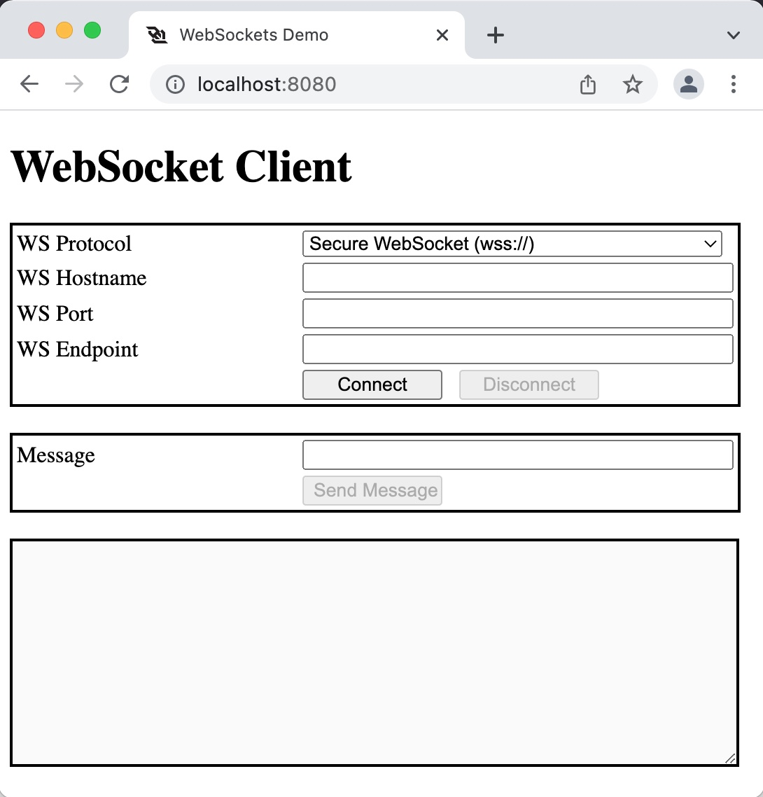
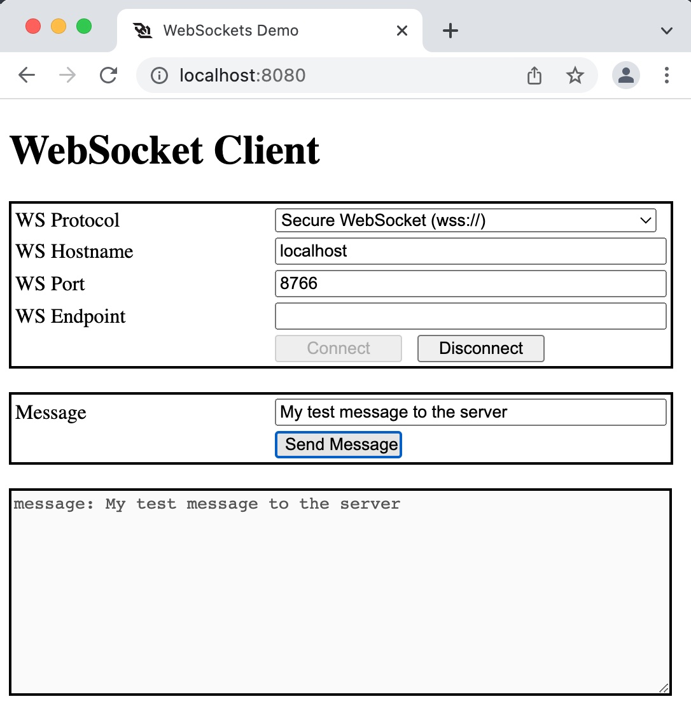


# Websocket Server

### Introduction

This is an example of a client/server WebSocket. The WebSocket Protocol enables two-way communication between a client and a remote server. It provides a persistent connection between the client and the server and both parties can sending data at any time.

The goal of this technology is to provide a mechanism for browser-based applications that need two-way communication with servers without the needs to open multiple HTTP connections.

>The WebSocket specification defines two URI schemes:   
>ws-URI = "ws:" "//" host [ ":" port ] path [ "?" query ]   
>wss-URI = "wss:" "//" host [ ":" port ] path [ "?" query ]   

The client is the browser with a simple JavaScript that will initiate the WebSocket. It could be either `ws://`, which is the equivalent to `http://`, or secure WebSocket `wss://`, which is the equivalent to `https://`. In this workshop, I implemented both normal and secure WebSocket. I took the code for the JavaScript [here](https://www.pegaxchange.com/2018/03/23/websocket-client/).

The server portion is implemented in Python. You can you any programming language (PHP, Go, NodeJS, ...). I took the code from Manos Pithikos. Check his GitHub page [here](https://github.com/Pithikos/python-websocket-server).

The web server and the WebSocket server run in a Docker container.

### Architecture


## Prerequisites

Before you begin with this guide, you'll need a basic understanding of the following technologies:

- Familiarity with [Docker](https://www.docker.com/).
- Familiarity with [Python](https://www.python.org/).
- Familiarity with [WebSockets - RFC6455](https://datatracker.ietf.org/doc/html/rfc6455).

## Step 1 - Clone all the files

Copy all the files from GitHub to your local drive and change directory.

```command
git clone https://github.com/ddella/WebSocket.git
cd WebSocket
```

## Step 2 — Web Server

You need a web server to present a web page for the users to enter all the parameters needed to create the WebSocket. The magic to create the TCP connection is done within the JavaScript.

The web page lets you enter the following information:

- Choose between WebSocket `ws://` or secure WebSocket `wss://` connection.
- The IP address of the WebSocket server.
- The TCP port the server listens on.

I made a workshop on building a simple web server with Nginx and PHP8. Take a look [here](https://github.com/ddella/PHP8-Nginx). The container is only 31Mb. This is the command to start the container in a custom network `frontend`. This network in a custom Docker network with the subnet `172.31.10.0/24`.

```command
docker run --rm -d -p 8080:80 -p 8443:443 --name webserver --hostname webserver --domainname example.com --ip 172.31.10.10 --env TZ='EAST+5EDT,M3.2.0/2,M11.1.0/2' --env TIMEZONE='America/New_York' --network frontend  -v $PWD/www/:/www -v $PWD/logs/:/var/log/nginx php8_nginx
```

The web server directory, inside the container, is mounted on your local drive in `$PWD/www/`. You will be able to change the HTML/CSS/JavaScript file without needing to restart the web server. I also mounted a local directory for the logs, in case you need to troubleshoot 😉.

If everything worked as expected, you should have a web server in a Docker container that you can reach with your favorite browser.



## Step 3 — WebSocket Server

The WebSocket server runs on Python. I built a Python Docker container based on Alpine Linux 3.15. The image is only 55.6MB. When building the image, only one package is required, `websockets` version 10.2.

This is the `requirements.txt` file needed to get all the packages (we need only one) when building the Python container. If you want more Python packages, just add them on a separate line.

```txt
[label requirements.txt]
websockets==10.2
```

### CREATE THE CERTIFICATE FOR SECURE WEBSOCKET `wss://`

Please read [this document](certificate.md) to create the certificate. This is a simple `SSL/TLS` certificate. The tricky part is to have a self signed certificate that Firefox/Chrome/Safari will accept. This is the part that I struggled the most. The troubleshooting part for the certificate part is extremely hard. Do not underestimate this part 😀.

If you use Firefox, you might get this error `SEC_ERROR_UNKNOWN_ISSUER`. It can be easily fixed by permitting Firefox to import any root certificate authorities (CAs) that have been added to the operating system. **DON'T FORGET TO ENFORE THE CHECK** back when you're done.

#### IMPORT ROOT CERTIFICATE AUTHORITIES

>**Warning**: Changing advanced preferences can affect Firefox's stability and security. This is recommended for **advanced users only**.

1. Open Mozilla Firefox on your computer.
2. In Firefox window, copy-paste `about:config` in the address bar and hit Enter.
3. Now, you will receive a message of caution. Click on `Accept the Risk and Continue` to proceed further. Advanced Preferences tab will be opened.
4. In the Advanced Preferences tab, click on the Search box and type “security.enterprise“.
5. In the search results, you will notice `security.enterprise_roots.enabled` and the status of it, normally stating `false`.
6. Click on the arrow sign of the particular option to switch its value to `true`.
7. Refresh the Websocket page.


### CREATE THE PYTHON DOCKER CONTAINER

1. Get the Python image from [Docker hub](https://hub.docker.com/_/python/). This is the official image based on Alpine. I wanted to keep the image as small as possible.

```command
docker pull python:alpine3.15
```

2. Create a file named `Dockefile`.

```docker
[label Dockerfile]
FROM python:alpine3.15
WORKDIR /usr/src/app
COPY requirements.txt ./
RUN pip3 install --no-cache-dir -r requirements.txt
```

3. Build the Docker image

Make sure you type the command as is. The `.` at the end of the command is important.
```command
docker build -t websocket_server .
```
4. Run WebSocket in Secure mode `wss://`

This command starts the WebSocket server in secure mode `wss://`. It exposes TCP port `10443`.

```command
docker run -it --rm --name wss --hostname wss --domainname example.com --ip 172.31.10.20 -p 10443:10443 --network frontend --mount type=bind,source="$(pwd)"/app,target=/usr/src/myapp,readonly -w /usr/src/myapp websocket_server python secure_ws.py 172.31.10.20 10443 websocket.pem
```

5. Run WebSocket in non-secure mode `ws://`

This command starts the WebSocket server in non-secure mode `ws://`. It exposes TCP port `10080`.

```command
docker run -it --rm --name ws --hostname ws --domainname example.com --ip 172.31.10.20 -p 10080:10080 --network frontend --mount type=bind,source="$(pwd)"/app,target=/usr/src/myapp,readonly -w /usr/src/myapp websocket_server python secure_ws.py 172.31.10.20 10080
```

You can start both WebSocket servers since they listen on different TCP port.

## Step 4 — Test the WebSocket Server

Start your browser, type this in the url bar `localhost:8080` and fill the information.



## Links

https://blog.teamtreehouse.com/an-introduction-to-websockets
https://www.pegaxchange.com/2018/03/23/websocket-client/
https://websockets.readthedocs.io/en/stable/index.html
https://github.com/Pithikos/python-websocket-server

## License

This project is licensed under the [MIT license](LICENSE).

### Clean the log file

Clean the log file from the log generated in the step above:
```command
: > logs/access.log
: > logs/error.log
```

[_^ back to top_](Websocket-Server)
