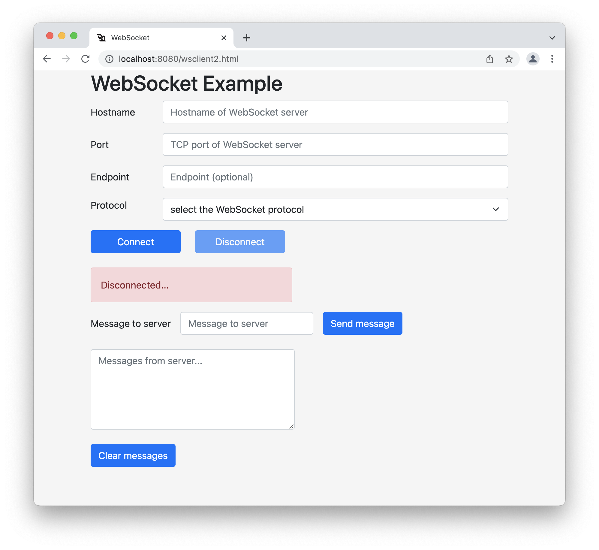

# WebSocket Client Server

### Introduction

This workshop is about building a client and server WebSocket on different Docker containers.

- Web Server on Nginx, that will host the JavaScript (the Client)
- Secure and Non-Secure WebSocket Server in Node JS (the Server)

The WebSocket Protocol enables bi-directional, full duplex communications protocol between a client and a server. It provides a persistent connection between them and both parties can sending data at any time. It is commonly used in modern web applications for streaming data and other asynchronous traffic. The goal of this technology is to provide a mechanism for browser-based applications that need two-way communication with servers without the need to open multiple HTTP connections.


>The WebSocket specification defines two URI schemes:   
>ws-URI = "ws:" "//" host [ ":" port ] "/" [path [ "?" query ]] (ws://websocket.example.com:6080/foo)  
>wss-URI = "wss:" "//" host [ ":" port ] "/" [path [ "?" query ]] (wss://websocket.example.com:6443/foo)  

In this workshop, I've 

1. Client - Web Broswer:
The client is a JavaScript running on the browser. It will initiate the WebSocket connection. The JavaScript client implements both secure and non-secure WebSocket communication. I took the code for the frontend, HTML and JavaScript, [here](https://www.pegaxchange.com/2018/03/23/websocket-client/).

2. Client - Node JS:
The client is a simple Node JS script. In this workshop, I implemented a simple script to get the round trip time of the connection.

3. Server - Node JS:

The server portion is implemented in Node JS. You can use any programming language for the server side like PHP, Go, Python, ... I took the code from the official Node JS librairy and made some small modification. Check the GitHub page [here](https://github.com/websockets/ws).

The WebSocket server accepts different `endpoint`. The `endpoint` is the `path` in the URL. See below the valid `path`. Anything outside of that will be rejected by the server and the connection will be terminated. All of the request can be made in secure or non-secure mode.

1. `ws[s]://hostname:port/`
2. `ws[s]://hostname:port/foo`
3. `ws[s]://hostname:port/bar`
4. `ws[s]://hostname:port/rtt`

> The URL `ws[s]://hostname:port/rtt` makes sense only with the Node JS client script 😉.

### Architecture

The workshop includes two servers, each in a Docker container on a _Docker custom network_.

- Nginx web server with **http://** on `TCP/8080` and **https://** on `TCP/8443`.
- Node JS WebSocket with **http://** / **ws://** on port `TCP/6080` and **https://** / **wss://** on port `TCP/6443`.

The Nginx web server hosts a standard HTML page to enter the information needed to establish a WebSocket connection. The other server is the Node JS WebSocket server.

>All the containers run on the same _Docker custom network_. This workshop is not about _Docker custom network_ but I encourage you to run your containers in custom network to get the added value of a DNS server. The following command was used to create the `frontend` network.
>
>```command
>docker network create --driver=bridge --subnet=172.31.10.0/24 --ip-range=172.31.10.128/25 --gateway=172.31.10.1 frontend
>```


### SERVER

The WebSocket server is a web server and a WebSocket server. It listens on TCP ports `TCP/6080` and `TCP/6443`. The client makes it's first request via HTTP/S asking for a connection upgrade. If the server is a real WebSocket server, it will accept the request and upgrade the procotol to WebSocket.

>The WebSocket server multiplex HTTP protocol and WebSocket protocol on the same port.

This is a Wireshark packet capture of the request from the client asking to `upgrade` the protocol to WebSocket.

      GET /foo HTTP/1.1
      Host: 127.0.0.1:6080
      Connection: Upgrade
      Pragma: no-cache
      Cache-Control: no-cache
      User-Agent: Mozilla/5.0 (Macintosh; Intel Mac OS X 10_15_7) AppleWebKit/537.36 (KHTML, like Gecko) Chrome/99.0.4844.51 Safari/537.36
      Upgrade: websocket
      Origin: http://localhost:8080
      Sec-WebSocket-Version: 13
      Accept-Encoding: gzip, deflate, br
      Accept-Language: en-US,en;q=0.9,fr;q=0.8
      Sec-WebSocket-Key: n6L8hzDkt+MaFqHE3iefTQ==
      Sec-WebSocket-Extensions: permessage-deflate; client_max_window_bits

This is a Wireshark packet capture of the response from the server that accept the request from the client.

      HTTP/1.1 101 Switching Protocols
      Upgrade: websocket
      Connection: Upgrade
      Sec-WebSocket-Accept: nmT+QYqF1fR7iiYoLneQlU9Vw+I=

## Prerequisites

Before you begin with this workshop, you'll need basic understanding of the following technologies:

- Familiarity with [Docker](https://www.docker.com/).
- Familiarity with [JavaScript](https://www.w3schools.com/js/).
- Familiarity with [Node JS](https://www.w3schools.com/nodejs/).
- Familiarity with [WebSockets - RFC6455](https://datatracker.ietf.org/doc/html/rfc6455).

## Step 1 - Clone all the files

Copy all the files from GitHub to your local drive and change directory. From now on, `$PWD` refers to the `WebSocket` directory.

```command
git clone https://github.com/ddella/WebSocket.git
cd WebSocket
```

## Step 2 — Web Server

You need a web server to present a web page for the users to enter all the parameters needed to create the WebSocket session. The magic to create the TCP connection is done within the JavaScript on the client browser. Most modern browser support WebSocket.

The web page lets you enter the following information to create the WebSocket session:

- The hostname/IP address of the WebSocket server.
- The TCP port the server listens on.
- The endpoint (optional).
- The WebSocket protocol, either non-secure `ws://` or secure `wss://` connection.

I made a workshop on building a simple web server based on Alpine Linux with Nginx and PHP8. Take a look [here](https://github.com/ddella/PHP8-Nginx). The container is only 31Mb. This is the command to start the container in a custom network `frontend`.

```command
docker run --rm -d -p 8080:80 -p 8443:443 --name webserver --hostname webserver --domainname example.com --ip 172.31.10.10 --env TZ='EAST+5EDT,M3.2.0/2,M11.1.0/2' --env TIMEZONE='America/New_York' --network frontend  -v $PWD/www/:/www -v $PWD/logs/:/var/log/nginx php8_nginx
```

The web server directory, inside the container, is mounted on your local drive in `$PWD/www/`. You will be able to change the HTML/CSS/JavaScript files without needing to restart the web server. I also mounted a local directory for the web server logs, in case you need to troubleshoot 😉.

If everything works as expected, you should have a web server in a Docker container that you can reach with your favourite browser with the url `http://localhost:8080`.



## Step 3 — WebSocket Server

The WebSocket server runs on Node JS. I used Docker container based on Alpine Linux 3.15 and Node JS 16.14. The image is only 168MB. You don't need to build the image, just pull it from Docker hub.

Pull the Node JS image:

```Docker
docker pull node:current-alpine
```

### CREATE THE CERTIFICATE FOR SECURE WEBSOCKET `wss://`

Secure WebSocket requires a standard `SSL/TLS` certificate, the same way as `https` do. In this workshop, we'll use a **self-signed** certificate. The tricky part is to have this self-signed certificate being accepted by your browser. This is the tricky part in this workshop. It will depend on the browser and operating system. Troubleshooting self-signed certificate can be hard 😀.

If you're on a Linux or macOS, use `openssl` to create the certificate. Just type the following commands to generate the self-signed certificate.

```command
openssl genrsa -out ssl/websocket_rootCA.key 4096
openssl req -x509 -new -nodes -key ssl/websocket_rootCA.key -sha256 -days 3650 -out ssl/websocket_rootCA.crt -config ssl/websocket.cnf -extensions v3_ca -subj "/CN=websocket Root CA"
openssl genrsa -out ssl/websocket.key 4096
openssl req -new -key ssl/websocket.key -out ssl/websocket.csr -config ssl/websocket.cnf -extensions v3_req
openssl x509 -req -in ssl/websocket.csr -CA ssl/websocket_rootCA.crt -CAkey ssl/websocket_rootCA.key -CAcreateserial -out ssl/websocket.crt -days 3650 -sha256 -extfile ssl/websocket.cnf -extensions v3_req
```

The file `websocket.crt` is your self-signed certificate. It needs to be marked as **trusted for this account** in your OS.

1. In the case of macOS, open the file `ssl/websocket.pem` in KeyChain. Right click -> Open With -> KeyChain Access (default)


2. Double clink on it and expand the **Trust**.

3. Select `Always Trust` for **Secure Sockets Layer (SSL)**. This is the minimal that is needed.


4. Close this windows by pressing the **Close button** on the top left corner (red circle). You will be asked for you credential.

5. The certificate status should be `This certificate is marked as trusted for this account`.


#### IMPORT ROOT CERTIFICATE AUTHORITIES (**FIREFOX ONLY**)

If you use **Firefox**, you might get the error `SEC_ERROR_UNKNOWN_ISSUER`. It can be easily fixed by permitting Firefox to import any root certificate authorities (CAs) that have been added to the operating system.

**DON'T FORGET TO ENFORE THE CHECK** back when you're done.

>**Warning**: Changing advanced preferences can affect Firefox's stability and security. This is recommended for **advanced users only**.

1. Open Mozilla Firefox on your computer.
2. In Firefox window, copy-paste `about:config` in the address bar and hit Enter.
3. Now, you will receive a message of caution. Click on `Accept the Risk and Continue` to proceed further. Advanced Preferences tab will be opened.
4. In the Advanced Preferences tab, click on the Search box and type “security.enterprise“.
5. In the search results, you will notice `security.enterprise_roots.enabled` and the status of it, normally stating `false`.
6. Click on the arrow sign of the particular option to switch its value to `true`.
7. Refresh the Websocket page.


Check the how-to on Mozilla's web site: 

### START THE WEBSOCKET SERVER

This container has the latest version of Node JS.

1. Open a `terminal` and change directory to `$PWD/server`.

```command
cd server
```

2. Start the WebSocket server with a shell.

This command starts the WebSocket server container and opens a shell. We need to install some packages before starting the server.

```Docker
docker run -it --rm --name wss --hostname wss --domainname example.com --ip 172.31.10.20 -p 9443:6443 -p 9080:6080 -v $PWD/:/run -w /run --network frontend current-alpine /bin/sh
```

3. Install Node JS modules.

This command starts the WebSocket server container and opens a shell. We need to install some packages before starting the server. The modules installed in the container will be permanent because the container maps it's `/run` directory on your local drive. The modules should be installed in `$PWD/server/node_modules`. If you terminate and restart the container in the same `$PWD`, all modules will be available.

```command
# install the WebSocket module
npm install --save-dev ws

# helps develop node.js based applications
npm install --save-dev nodemon

# masking and unmasking the data payload of the WebSocket frames
npm install --save-dev bufferutil

# Allows to efficiently check if a message contains valid UTF-8
npm install --save-dev utf-8-validate
```

4. Start the WebSocket server.

This command starts one WebSocket server with two listening ports, one for non-secure mode, `ws://`, and one for secure mode, `wss://`.
>The Node JS server listen on both TCP port `6080` and `6443`.  
>- The Docker host maps TCP port `9080` to `6080` on the Docker container.  
>- The Docker host maps TCP port `9443` to `6443` on the Docker container.  


```Docker
docker run -it --rm --name wss --hostname wss --domainname example.com --ip 172.31.10.20 -p 9443:6443 -p 9080:6080 -v $PWD/:/run -w /run --network frontend node:current-alpine npm run dev
```

If you want to map other TCP ports, you can pass then as environement variable to the Docker container.

```Docker
docker run -it --rm --name wss --hostname wss --domainname example.com --ip 172.31.10.20 -p 9443:443 -p 9080:80 -v $PWD/:/run -w /run --network frontend --env WS_PORT=80 --env WSS_PORT=443 node:current-alpine npm run dev
```

## Step 4 — Test the WebSocket Server

### Test via the web server

Start a connection to the WebSocket server by using client browser. The web server sends a standard HTML page with a JavaScript. It's the JavaScript that will initiate the connection to the WebSocket server.

1. Start your favorite browser
2. Type the url `localhost:8080`
3. Fill the information and press `connect`.
4. Type a message in the `input message box` and hit the button `Send Message`. If successful, the server will send the message back in the box below.


>Those are the different `endpoint` accepted by the server. The endpoint `/rtt` does only make sense with the Node JS client.
>>- /foo  
>>- /bar  
>>- /  
>>- /rtt  

### Test via a Node JS client application script

The command line client initiate a connection to the server. The client just sends the time, in `ms`, to the server and waits for the server to send the time back. It calculates the round-trip time and prints it. The server has been built to close the WebSocket after sending the time.

You need to have Node JS installed locally, if you don't or don't want to install it, just run the script from another Node JS Docker container.

1. Open a `terminal` and change the directory to `$PWD/server`.

```command
cd server
```

2. Run the client from the command line.

For `non secure` WebSocket:

```command
node client-rtt.js ws://127.0.0.1:9080
```

For `secure` WebSocket:

```command
node client-rtt.js wss://127.0.0.1:9443
```

The output of the client should be:

```txt
connected
Round-Trip Time: 2 ms
disconnected
```

## TEST THE CERTIFICATE (OPTINAL)

In case you run into problem with the secure WebSocket, you can use the commands below to check whether the certificate is valid, trusted, and complete.
Open a `terminal` window.

```command
openssl s_client -connect 127.0.0.1:9443
```

You can also use `curl`.

>The `-k` allows curl to proceed and operate even for server connections otherwise considered insecure, like self-signed certificate.

```command
curl -kvI https://127.0.0.1:9443
```

## Clean up

When you're done, it's always a good idea to clean everything. If you followed all the steps, you should have two Docker containers running. For the WebSocket servers, just press `CTRL-C` and it should terminate. The only one left is the Web Server. Following is the command to terminate the web server container.

```command
docker rm -f webserver
```

Check that both of the Docker container you started are terminated.

```command
docker ps -a
```

## Useful Links

- [Nice basic WebSocket tutorial](https://blog.teamtreehouse.com/an-introduction-to-websockets)
- [How Do Websockets Work?](https://sookocheff.com/post/networking/how-do-websockets-work/)
- [WebSocket Client frontend](https://www.pegaxchange.com/2018/03/23/websocket-client/)
- [Python websockets module](https://websockets.readthedocs.io/en/stable/index.html)
- [Manos Pithikos Python WebSocket server](https://github.com/Pithikos/python-websocket-server)
- [WebSocket API](https://developer.mozilla.org/en-US/docs/Web/API/WebSockets_API)

- [ws: a Node.js WebSocket library](https://www.npmjs.com/package/ws)
- [WebSockets - Living Standard](https://websockets.spec.whatwg.org/)
- [HTTP protocol and WS protocol reuse the same port](https://programmer.group/in-nodejs-http-protocol-and-ws-protocol-reuse-the-same-port.html)


## License

This project is licensed under the [MIT license](LICENSE).

[_^ back to top_](#Websocket-Client-Server)
