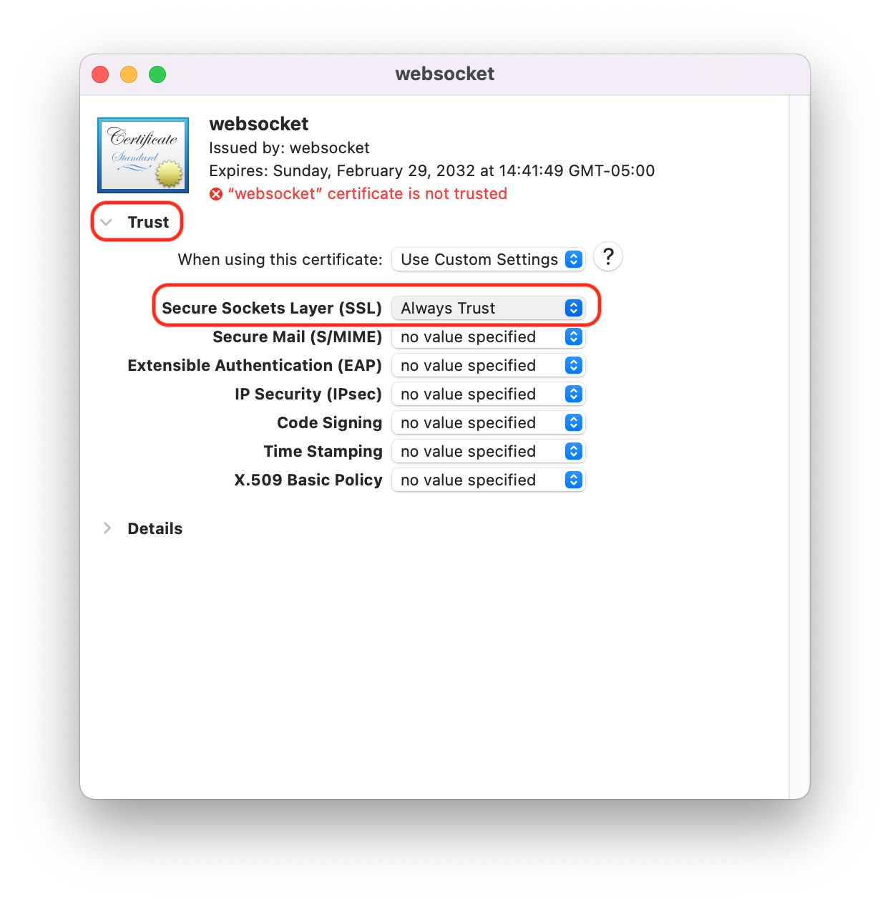
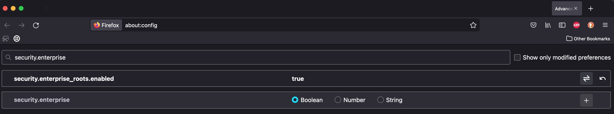

# Web Server / WebSocket Server SSL/TLS certificate

## Introduction

To be able to use secure WebSocket, `wss://`, you need to buy or create an `SSL/TLS` certificate. Since it's for a workshop, I decided to create my own certificate and trust it in my OS.

Steps to create a self-signed SSL/TLS certificate. This can be used for `https://` or WebSocket server `wss://`.

If you cloned this workshop and followed all the steps, you should be in the directory `server` and have the sub-directory `ssl` with only the file `websocket.cnf`.

You can generate two types of certificate,
1. a self-signed certificate.
2. a certificate signed by your private CA.
>For this workshop both will work just fine. Just do one of the preceding steps, it won't do any harm if you do both.

3. The last step is to **trust** the cetificate you created.

## 1. Create a Self-signed certificate

1. create a private key for your WebSocket server

```command
openssl genrsa -out ssl/ws-private-key.pem 4096
```

2. generate the Certificate Signing Request (CSR)

```command
openssl req -new -key ssl/ws-private-key.pem -out ssl/ws-csr.pem -config ssl/websocket.cnf -extensions v3_req
```

3. create the certificate for the WebSocket server

```command
openssl x509 -req -in ssl/ws-csr.pem -signkey ssl/ws-private-key.pem -out ssl/ws-public-cert.pem -days 3650 -sha256 -extfile ssl/websocket.cnf -extensions v3_req
```

This is the code in NodeJS to read the certificate.

```nodejs
const options = {
  cert: readFileSync('ssl/ws-public-cert.pem'),
  key: readFileSync('ssl/ws-private-key.pem')
};
```

If you're on a macOS, this certificate will look like this, in KeyChain, when it will be `trusted`:


## 2. Create a Certificate signed by your private CA

1. create a private key for your CA

```command
openssl genrsa -out ssl/websocket_rootCA.key 4096
```

2. generate your root certificate for your CA

```command
openssl req -x509 -new -nodes -key ssl/websocket_rootCA.key -sha256 -days 3650 -out ssl/websocket_rootCA.crt -config ssl/websocket.cnf -extensions v3_ca -subj "/CN=websocket Root CA"
```

3. create a private key for your WebSocket server

```command
openssl genrsa -out ssl/websocket.key 4096
```

4. generate the Certificate Signing Request (CSR)

```command
openssl req -new -key ssl/websocket.key -out ssl/websocket.csr -config ssl/websocket.cnf -extensions v3_req
```

5. create the certificate for the WebSocket server

```command
openssl x509 -req -in ssl/websocket.csr -CA ssl/websocket_rootCA.crt -CAkey ssl/websocket_rootCA.key -CAcreateserial -out ssl/websocket.crt -days 3650 -sha256 -extfile ssl/websocket.cnf -extensions v3_req
```

This is the code in NodeJS to read the certificate.

```nodejs
const options = {
  cert: readFileSync('ssl/websocket.crt'),
  key: readFileSync('ssl/websocket.key')
};
```

If you're on a macOS, this certificate will look like this, in KeyChain, when it will be `trusted`:


## 3. Trust certificate (macOS)

If you follow step #1, the file `ws-public-cert.pem` is your self-signed certificate. If you followed step #2, the file `websocket.crt` is your self-signed certificate.

It needs to be marked as **trusted for this account** in your OS.

1. In the case of macOS, open the file vertificate file in KeyChain. Right click -> Open With -> KeyChain Access (default)


2. Double clink on it and expand the **Trust**.

3. Select `Always Trust` for **Secure Sockets Layer (SSL)**. This is the minimal that is needed.



4. Close this windows by pressing the **Close button** on the top left corner (red circle). You will be asked for you credential.

5. The certificate status should be `This certificate is marked as trusted for this account`.


#### IMPORT ROOT CERTIFICATE AUTHORITIES (**FIREFOX ONLY**)

If you use **Firefox**, you might get the error `SEC_ERROR_UNKNOWN_ISSUER`. It can be easily fixed by permitting Firefox to import any root certificate authorities (CAs) that have been added to the operating system.

**DON'T FORGET TO ENFORE THE CHECK** back when you're done.

>**Warning**: Changing advanced preferences can affect Firefox's stability and security. This is recommended for **advanced users only**.

1. Open Mozilla Firefox on your computer.
2. In Firefox window, copy-paste `about:config` in the address bar and hit Enter.
3. Now, you will receive a message of caution. Click on `Accept the Risk and Continue` to proceed further. Advanced Preferences tab will be opened.
4. In the Advanced Preferences tab, click on the Search box and type “security.enterprise“.
5. In the search results, you will notice `security.enterprise_roots.enabled` and the status of it, normally stating `false`.
6. Click on the arrow sign of the particular option to switch its value to `true`.
7. Refresh the Websocket page.



Check the how-to on Mozilla's web site: 

[_^ go back to_](./README.md#START-THE-WEBSOCKET_SERVER)
